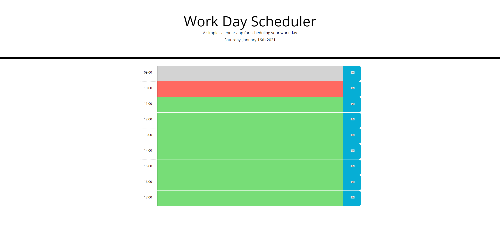

# Workday scheduler

## Explanation of the application  

To create a scheduling page that would change the colouring of each hour block depending on whether it was in the past, present or future. As well as allowing the user to input information, and for the page to retain that information when the page is refreshed.  

## Live link to the deployed application  

The live site is found at [GitHubPages](https://clairemdavies.github.io/work-day-scheduler-app/) 

## Screenshots of the application  

Screenshots of the page follows:  
  

## Technologies used
- HTML
- CSS
- JavaScript
- jQuery
- Bootstrap
- Font Awesome
- Google APIS
- Moment.js

## License  

Licensed under the [MIT License](LICENSE)

## Contact Information  

Claire Davies: [Github](https://github.com/ClaireMDavies)